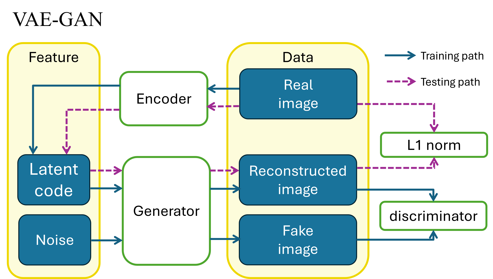

VAE-GAN
===
 ### 原始的paper
> #### [Autoencoding beyond pixels using a learned similarity metric](https://arxiv.org/pdf/1512.09300.pdf "游標顯示")
 ### 我們用的code  
> #### [VAE-GAN-PYTORCH](https://github.com/rishabhd786/VAE-GAN-PYTORCH?source=post_page-----8f9db4aeb7a2-------------------------------- "游標顯示")

### VAE-GAN的架構圖
>  

### 各檔案描述
> [dataloader.py](dataloader.py "游標顯示")
>
>> 處理資料，預設為會調整成size 64*64的圖片，batch大小也為64，會從csv檔中讀圖片的full path與label， _class CustomDataset(Dataset)_ 有兩種，分別是讀dicom檔的與讀png或jpg。
>> 不管training、testing還是生heatmap，都是到dataloader中改資料的路徑。
>>  

> [heatmap.py](heatmap.py "游標顯示")
>> 生成reconstructed image和heatmap，要生成的圖片路徑要去dataloade改 
> [train過50個epoch的權重](https://drive.google.com/file/d/1TlYe8T2GJ6QwU5NtXP88F8b2J1Ko9we7/view?usp=sharing "游標顯示") (image size:64*64,batch size:64)
>> 太大了所以丟雲端。
> [main.py](main.py "游標顯示")
>> 就是train的過程，18行有改weight路徑的地方，training data的路徑要去dataloader改。
> [models.py](models.py "游標顯示")
>> 就是model的架構。
> [testing.py](testing.py "游標顯示")
>> testing及繪製ROC curve，testing data的路徑要去dataloader改。
>[utils.py](utios.py "游標顯示")  
>> 其他作者自己定義的function。

