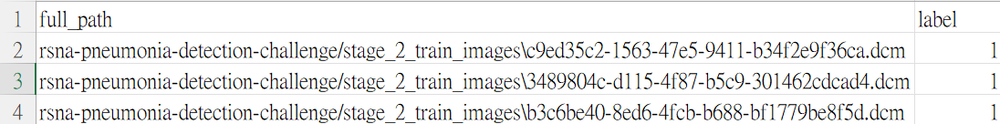

VAE-GAN
===
 ### Original Paper
> #### [Autoencoding beyond pixels using a learned similarity metric](https://arxiv.org/pdf/1512.09300.pdf "游標顯示")
 ### Code We Used 
> #### [VAE-GAN-PYTORCH](https://github.com/rishabhd786/VAE-GAN-PYTORCH?source=post_page-----8f9db4aeb7a2-------------------------------- "游標顯示")

Architecture Diagram of VAE-GAN
>

### File Descriptions
> [dataloader.py](dataloader.py "游標顯示")
>> Handles the data, with the default set to adjust images to 64x64 in size and a batch size of 64. It reads the full path and label of the images from a CSV file. The _class CustomDataset(Dataset)_ has two options: one for reading DICOM files and another for reading PNG or JPG.

>> Whether for training, testing, or generating heatmaps, the data path is modified in the dataloader.

>> Format of the CSV file that stores image paths and labels:
>> 
>> 
> [heatmap.py](heatmap.py "游標顯示")  
>> Generates reconstructed images and heatmaps. The path to the weights can be changed at line 18, and the path of the images to be generated must be changed in the dataloader.
>>  
> [main.py](main.py "游標顯示")
>> This is the training process. The path to the weights can be changed at line 18, and the path to the training data must be changed in the dataloader.
>> 
> [models.py](models.py "游標顯示")
>>  The architecture of the model.
>> 
> [testing.py](testing.py "游標顯示")
>> Testing and ROC curve plotting. The path to the weights can be changed at line 20, and the path to the testing data must be changed in the dataloader.
>> 
>[utils.py](utils.py "游標顯示")  
>> Other custom functions defined by the author.
>> 
> [Weights after 50 epochs of training ](https://drive.google.com/file/d/1TlYe8T2GJ6QwU5NtXP88F8b2J1Ko9we7/view?usp=sharing "游標顯示") (image size:64*64,batch size:64)
>> 太大了所以丟雲端。
>>
### Usage Instructions
> After adjusting the data path in the dataloader, run the necessary scripts for training, testing, or generating heatmaps:
> 
> ```python
> python main.py
> ```
> 
> ```python
> python testing.py
> ```
> 
>  ```python
> python heatmap.py
> ```
>  (原始的code是說用python3，但我們用python3跑不了反而是python跑得了)
> 


VAE-GAN(中文版)
===
 ### 原始的paper
> #### [Autoencoding beyond pixels using a learned similarity metric](https://arxiv.org/pdf/1512.09300.pdf "游標顯示")
 ### 我們用的code  
> #### [VAE-GAN-PYTORCH](https://github.com/rishabhd786/VAE-GAN-PYTORCH?source=post_page-----8f9db4aeb7a2-------------------------------- "游標顯示")

### VAE-GAN的架構圖
>

### 各檔案描述
> [dataloader.py](dataloader.py "游標顯示")
>> 處理資料，預設為會調整成size 64*64的圖片，batch大小也為64，會從csv檔中讀圖片的full path與label， _class CustomDataset(Dataset)_ 有兩種，分別是讀dicom檔的與讀png或jpg。
>> 
>> 不管training、testing還是生heatmap，都是到dataloader中改資料的路徑。
>>
>> 儲存圖片路徑及標籤的csv檔格式
>> 
>> 
> [heatmap.py](heatmap.py "游標顯示")  
>> 生成reconstructed image和heatmap，18行有改weight路徑的地方，要生成的圖片路徑要去dataloader改。
>>  
> [main.py](main.py "游標顯示")
>> 就是train的過程，18行有改weight路徑的地方，training data的路徑要去dataloader改。
>> 
> [models.py](models.py "游標顯示")
>> 就是model的架構。
>> 
> [testing.py](testing.py "游標顯示")
>> testing及繪製ROC curve，20行有改weight路徑的地方，testing data的路徑要去dataloader改。
>> 
>[utils.py](utils.py "游標顯示")  
>> 其他作者自己定義的function。
>> 
> [train過50個epoch的權重](https://drive.google.com/file/d/1TlYe8T2GJ6QwU5NtXP88F8b2J1Ko9we7/view?usp=sharing "游標顯示") (image size:64*64,batch size:64)
>> 太大了所以丟雲端。
>>
### 使用方法
> 在dataloader改好資料路徑後依需要training、testing或生heatmap執行
> 
> ```python
> python main.py
> ```
> 
> ```python
> python testing.py
> ```
> 
>  ```python
> python heatmap.py
> ```
>  (原始的code是說用python3，但我們用python3跑不了反而是python跑得了)
> 


